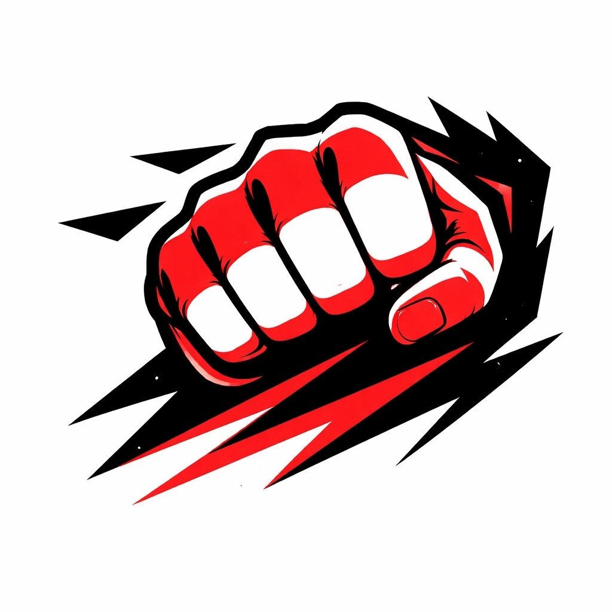

# Ehrgeiz Godhand

<p align="center">
  
</p>

**Panel-driven Discord bot for Tekken 8 communities — role assignment by rank/ELO, bracket forming, and general moderation.**

> Hello, this bot was created by Claude as an open source project with my prompt and direction. I want this bot to be useful for as many people as possible, because Tekken needs Tournaments. Any improvements I'd love, and you can clone this bot and use it however. This is for the community, for every group that wants it. Ehrgeiz Godhand is a light reference, and the original server this bot was created for does not matter; have fun ;)
>
> — Detcader_

---

Players verify with their Polaris Battle ID, their in-game rank becomes a Discord role, and (coming soon) organizers run rank-seeded Swiss tournaments with auto-provisioned per-match voice channels.

Built to be run either on a laptop for one friendly server or 24/7 as a public hosted instance. Self-host and hosted deployment are both first-class.

📖 **[Read the full project spec (SPEC.md)](SPEC.md)** — vision, design principles, anti-abuse posture, tournament design, and the phased roadmap.

## Features

**One-command server setup** — `/setup-server` provisions the entire server structure in ~30 seconds: categories, text + voice channels, staff-only perms, and role hierarchy. Declarative plan in [`cogs/setup.py`](cogs/setup.py) — fork the repo and edit `SERVER_PLAN` / `ROLE_PLAN` to adapt it to your community. Idempotent; safe to re-run.

**Onboarding & rank sync**
- Unified Player Hub panel with buttons: Verify, My Profile, Refresh Rank, Set Rank Manually, Unlink Me.
- Verification via Polaris Battle ID — bot looks up the player on [wank.wavu.wiki](https://wank.wavu.wiki) and confirms the name/main character with the user before granting roles.
- Auto-detects current Tekken rank with a two-source chain: wavu's replay API first (authoritative for very recent matches), then [ewgf.gg](https://ewgf.gg) (covers inactive players). Falls back to a two-stage self-report dropdown if neither source has the player.
- One Tekken ID per Discord account (enforced at the DB level); admins can override via `/admin-link`.
- Persistent panels with stable custom IDs — buttons keep working after bot restarts.
- Ephemeral responses with auto-delete so channels stay clean.
- **5-minute TTL cache + single-flight dedupe** on every wavu/ewgf lookup so rapid clicks and multi-guild bursts don't hammer the upstream sites.

**Anti-abuse**
- **Audit log** — every link, unlink, rank change, and admin override is posted to a staff-only `#verification-log` channel for review.
- **7-day relink cooldown** on changing to a *different* Tekken ID after an unlink. Same-ID re-link is allowed immediately. Auto-cleared after 7 days; admins can clear sooner with `/admin-clear-cooldown` or override with `/admin-link`.
- **Tiered verification for high-rank claims** — Tekken King and above (across self-report, wavu, ewgf) goes to **Pending Verification**: the user is granted Verified but no rank role until any Admin/Mod/Organizer clicks **Confirm** on the audit-log post. Stale after 72h (claim shown as self-reported, no rank role) but Confirm/Reject buttons remain functional. Persistent across bot restarts.

**Planned**
- Swiss tournaments seeded by rank tier
- Pillow-rendered bracket images
- Auto-provisioned per-match invite-only voice channels
- Organizer-confirmed cleanup + archive to a tournament-history channel
- Moderation cog (kick / ban / timeout / warn-with-history / purge)

## Setup

### 1. Create a Discord bot

1. Go to the [Discord Developer Portal](https://discord.com/developers/applications), create a new application.
2. Open the **Bot** tab, enable all three **Privileged Gateway Intents** (Presence, Server Members, Message Content).
3. Click **Reset Token** and copy it.
4. Under **OAuth2 → URL Generator**, check `bot` + `applications.commands`, and give it `Administrator` permission (simplest for a friendly server — tighten later). Open the generated URL to invite the bot to your server.
5. In Discord, drag the bot's role above any role you want it to manage (Server Settings → Roles).

### 2. Install

Requires Python 3.10+.

```bash
git clone https://github.com/gnutgnut/ehrgeiz-godhand.git
cd ehrgeiz-godhand
python -m venv .venv
# Windows
.venv\Scripts\activate
# Linux/Mac/WSL
source .venv/bin/activate
pip install -r requirements.txt
```

### 3. Configure

Copy `.env.example` to `.env` and fill in:

| Variable | What it is |
|---|---|
| `DISCORD_TOKEN` | Bot token from the Developer Portal |
| `GUILD_ID` | Your server's ID (Developer Mode → right-click server → Copy Server ID) |
| `VERIFIED_ROLE_NAME` | Name of the role verified users get (default `Verified`) |
| `ORGANIZER_ROLE_NAME` | Name of the tournament-organizer role (default `Organizer`) |
| `MOD_LOG_CHANNEL_ID` | *(Optional, for future mod cog)* |

### 4. Run

```bash
python bot.py
```

### 5. Build your server with one command

In your (empty or nearly-empty) Discord server, run:

```
/setup-server
```

The bot previews the full layout (categories, channels, roles). Click **Build it** and it creates everything in ~30–60 seconds: 7 categories, 16 channels, 4 roles, staff-only perms on the Staff category, and it auto-posts the Player Hub panel in `#player-hub`.

The command is idempotent — anything that already exists by name is skipped. Safe to run again after you edit the plan.

After setup, drag the bot's role **above** the new rank/admin/mod roles in Server Settings → Roles (Discord requires this for the bot to manage those roles).

## How the rank lookup works

There's no official Tekken player-lookup API, so the bot uses two community sites in a chain:

1. **Display name + main character** come from `https://wank.wavu.wiki/player/{TekkenID}` (HTML scrape in [`wavu.py`](wavu.py)).
2. **Current rank** is resolved by trying sources in order:
   - **wavu's `/api/replays` endpoint** — paginates through the most recent matches, returns the `p1_rank` / `p2_rank` int when a record contains the player's Polaris ID. Mapped to a tier name via the `TEKKEN_RANKS` table in `wavu.py`. Authoritative but only sees roughly the last 35 minutes of play.
   - **[ewgf.gg](https://ewgf.gg) scrape** ([`ewgf.py`](ewgf.py)) — fetches `https://ewgf.gg/player/{TekkenID}` and regex-extracts `currentSeasonRank` / `allTimeHighestRank` strings from the React Server Components payload embedded in the page. Returns the highest current-season rank across all characters; falls back to the highest all-time rank if no current-season data exists.
3. **Self-report dropdown** — if both sources strike out, the user picks their rank from a two-stage dropdown.

**If wavu or ewgf change their markup**, only the matching client file (`wavu.py` / `ewgf.py`) needs updating — the rest of the bot treats them as abstract data sources.

## Architecture

```
bot.py              # Entry point. Loads cogs, syncs slash commands to guild.
db.py               # aiosqlite helpers. Tables: players, warnings, panels.
wavu.py             # wavu.wiki client. PlayerProfile, replay-API rank lookup, rank map.
ewgf.py             # ewgf.gg client. Fallback rank lookup via RSC payload scrape.
cogs/
  onboarding.py     # PlayerHubView + verify/refresh flows + rank-source chain.
  setup.py          # /setup-server: declarative SERVER_PLAN / ROLE_PLAN provisioner.
```

**Schema (SQLite):**
- `players(discord_id PK, tekken_id UNIQUE, display_name, main_char, rating_mu, rank_tier, last_synced, linked_by)`
- `warnings(id, discord_id, issued_by, reason, issued_at)`
- `panels(guild_id, kind, channel_id, message_id)` — one row per guild+panel kind, so reposts delete the old message.

## Credits

- **[Wavu Wank](https://wank.wavu.wiki/)** — primary source for player profiles and very-recent rank data. Please don't abuse it (the bot uses a custom User-Agent and single-flight requests).
- **[ewgf.gg](https://ewgf.gg)** — secondary rank source covering inactive players. Lookups are on-demand and per-user, no scraping at scale.
- Built with **[discord.py](https://github.com/Rapptz/discord.py)** (v2.x).

## License

MIT — see [LICENSE](LICENSE).

## Contributing

PRs welcome. A few things worth knowing:

- The rank-ID → tier-name table in `wavu.py` (`TEKKEN_RANKS`) is community-sourced; if you find a wrong mapping, please open a PR with a citation.
- Scraping logic lives entirely in `wavu.py`. If wavu changes their markup, that's the only file that should need edits.
- The bot currently has no automated tests — add some if you're changing non-trivial logic.
